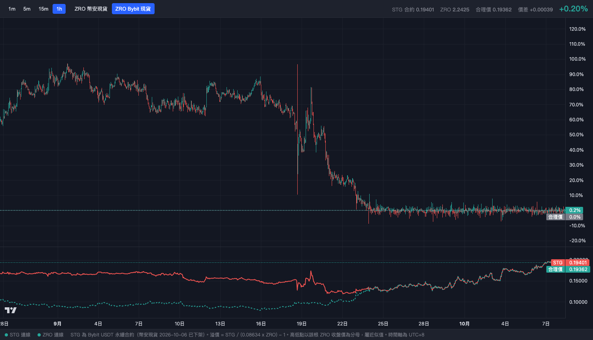
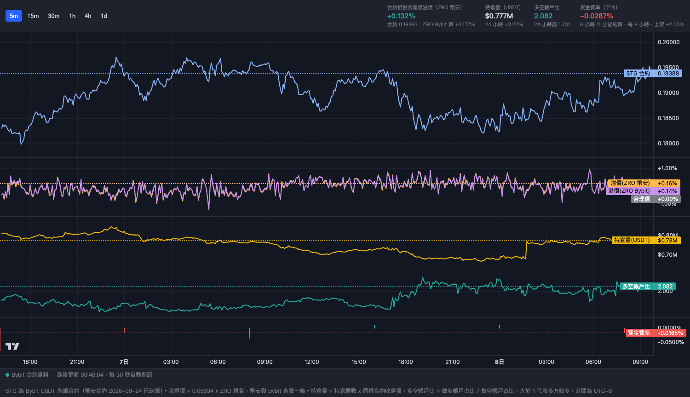

# stg-premium-chart

Static web pages that track the STG token against its fixed ZRO conversion ratio of 1 STG = 0.08634 ZRO, using public market data from Bybit and Binance. There is no backend and no API key. The browser calls the exchanges directly, so the charts keep updating while the tab is open.

Data sources since October 2026: Binance settled its STGUSDT perpetual on 2026-09-24 and delisted STG spot on 2026-10-06, so STG now comes from the Bybit STGUSDT perpetual. Bybit has no STG spot market. ZRO can come from Binance spot, Bybit spot or the Bybit ZROUSDT perpetual. Bybit delists the STGUSDT perpetual on 2026-10-10 09:00 UTC, and the pages have no live STG data after that.

## Pages

- `index.html`: the home page. Live premium, funding rate and open interest, refreshed every 10 seconds, with a button for each chart page. Every chart page has a home button back to it. Below the numbers is a pair-trade calculator built from the live Bybit order books, refreshed about once a second. Type a notional per leg and it shows:
  - Slippage: the average fill price, slippage from mid and worst fill price for a market buy or sell of STG and of ZRO, walking up to 500 levels of the book.
  - Capacity: the largest notional each of those market orders can fill before slippage passes 0.1%, 0.25%, 0.5% and 1%.
  - Strategies: the STG discount strategy goes long STG and short ZRO; the STG premium strategy goes short STG and long ZRO. Each row has the entry fills, gross and net profit, the return on 1x capital and the funding paid or received per settlement. Each strategy has two exits. Closing before settlement assumes STG returns to fair value with the same slippage as the current book. Holding to settlement closes the STG leg at the current index price, standing in for the 30-minute index average, with no slippage or fee on that leg. Fees are the non-VIP taker rate of 0.055% per fill.
  - Position size: for each strategy and exit, the notional with the highest net profit and the largest notional that still nets a profit.
- `premium.html`: premium candles of the Bybit STG perpetual over its fair value, which is 0.08634 times the ZRO spot price, with a price panel below. Choose Binance spot, Bybit spot or the Bybit perpetual for ZRO, and 1m, 5m, 15m or 1h candles. The fair-value label also shows the ZRO price. It polls both exchanges every 2 seconds.
- `settlement.html`: settlement price calculator for the Binance STGUSDT perpetual delisting, kept as a record of the 2026-09-24 settlement. It still reads Binance. Binance's delisting FAQ defines the settlement price as the average of the per-second index price over the last 30 minutes, 1,800 samples in total. The page draws the index price and a rolling 30-minute average. Inside the window it also draws a running average and a projected settlement price.

- `derivatives.html`: positioning charts for the Bybit STGUSDT perpetual. Panels for price, the premium over fair value with one line per ZRO source, open interest in USDT, the long/short account ratio and the funding rate. It refreshes every 30 seconds. Bybit doesn't publish top-trader or taker ratios, so those panels from the Binance version are gone.

  

- `longterm.html`: the long view since 2025-08-01. Premium candles over the fixed ratio, STG price against fair value on a log scale, volume, and the settled funding rate history, all from the Bybit perpetual. Choose Binance or Bybit for ZRO, 1h, 4h, 1d or 1w candles, and a 1M, 3M, 6M or full range. Event markers show the acquisition proposal, the DAO vote and the 2026-06-12 spike.

## Use

Open a page in a browser, or serve the folder with any static host such as GitHub Pages. To rehearse the settlement window before the real one, add `?start=` with an ISO time, for example `settlement.html?start=2026-09-20T10:30:00%2B08:00`.

## Notes

- Times on the charts are UTC+8.
- The delisting window in `settlement.html` defaults to 2026-09-24 16:30 to 17:00 UTC+8. Change `WS_ISO` in the file or use `?start=`.
- Seconds before the page opened are filled from 1-minute index prices, so they are approximate. The status panel shows how many real per-second samples were collected.
- Keep the settlement page in a foreground tab. Browsers slow timers in background tabs.
- Open interest is the Bybit `openInterest` count times the perpetual close of the same candle, the same basis as Bybit's `openInterestValue`.
- Binance and Bybit block some regions. If an API is unreachable from your network, the charts that need it stay empty.
- Charts use [Lightweight Charts](https://github.com/tradingview/lightweight-charts) 5.0.8 from jsDelivr, pinned with a Subresource Integrity hash.

Nothing here is financial advice.

## License

MIT
